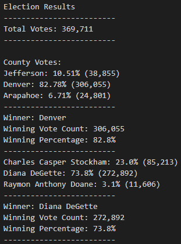

# Election Analysis

## Overview of Election Audit
### Purpose
To use python to read election data and write the results to a seperate text file.

## Election-Audit Results

* 369,711 votes were cast in this congressional election.

* Jefferson county contributed **38,855** votes (roughly **10.5%**), Arapahoe county **24,801** votes (**6.7%**), and Denver County **306,055** votes (roughly **82.8%**)

* **Denver County** dominated this congressional Elction with the contribution of nearly 83% of all the votes cast.

* Canidate Charles Casper Stockham recieved **85,213** votes (**23%**), Canidate Raymon Anthony Doane **11,606** votes (**3.1%**), and  Canidate Diana DeGette **306,055** votes (**73.8%**)

* Canidate Diana DeGette mangaged to win the congressional elction in a landslide by winning nearly 74% of the popular vote at a tally of **306,055**.

## Summery
This script can be used in various state congressional elections, and with some slight tweaks national elections. With this data set there were only 3 canidates and 3 counties, but the script is scaleable. One draw down is that the way the script is written, the incoming data set has to be specifically formated with the county in the second column and the canidate in the third. If we stored the header row from the file in a variable, we would have more flexabiltiy to work with in terms of data formating. 